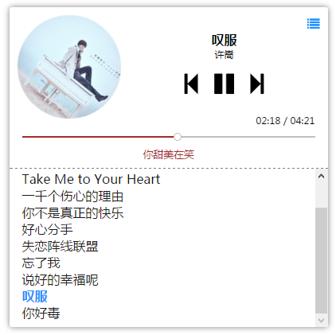
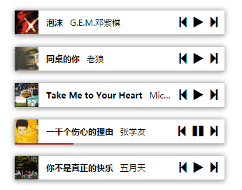

HTML5 Player
===


Installation
---
``` sh
$ bower install h5player
```

Usage
---
``` html
<script src="player-with-css.min.js"></script>
<div id="player"></div>
<script>
var player = new Player({
	container: document.getElementById('player'),
	image: 'http://example.com/path/to/default/image',
	lyricCallback: function (song, cb) {
		var lyric=getLyricFromSomewhereElse(song);
		cb(lyric);
	},
});
player.setSongs([
	{
		name: 'Song1',
		url: 'http://example.com/path/to/song1.mp3',
		additionalInfo: 'whatever',
	}, {
		name: 'Song2',
		url: 'http://example.com/path/to/song2.mp3',
	}
]);
player.play(0);
</script>
```

Document
---
After loading `dist/player-with-css.min.js`, there will be a global variable `Player`.

Each player is built with `new Player(options)`. *options* is an object with properties below:

* `container`: *required* DOM  
  Reference to a DOM element to hold the player panel.

* theme: *optional* string  
  currently there are two themes available: **simple** and **normal**. The default value is **normal**.

* `image`: *optional* string *or* object  
  Image shown when no image is assigned for the current song.  
  It can be a string of the path to the image or an object with theme names as the keys and
  image paths as the values.  
  The recommended image size for **normal** theme is 130 * 130, and 34 * 34 for **simple** theme.

* classes: *optional* object  
  A dict with custom classes of each button, the default values are:
	``` javascript
classes: {
  list: 'fa fa-list',
  prev: 'fa fa-step-forward',
  play: 'fa fa-play',
  next: 'fa fa-step-forward',
  pause: 'fa fa-pause',
}
	```
	Notice: the default values require [Font-Awesome](http://fontawesome.io).

* lyricCallback: *optional* function  
  An async function to get the lyric. There are two parameters for the callback. The first parameter is the song object and the second is a callback to send the lyric to the player.

The `Player` object has following methods:

* setSongs(*Array* songs)  
  set playlist for the player, *songs* is a list of `object`s with properties below:
	* name: *required* string  
	  The name of the song.
	* url: *required* string  
	  A downloadable URL.
	* artist: *optional* string  
	  The name of the artist.
	* duration: *optional* integer  
	  Length of the song in seconds.
	* image: *optional* string *or* object  
	  The image for the current song. Similar to the default image in common settings.
	* lyric: *optional* string  
	  Lyric of the song. May be something like `[00:00]foo\n[00:05]bar\n...`.

* play(*int* index)  
  start playing the *index*-th song.

When the play status is changed, a `PlayerEvent` will be fired with its `detail` set to an object with following attributes:

* player  
  the `Player` object that is related to this event

* type  
  `'play'` or `'pause'`

Demos
---
* <http://gerald.top/code/h5player>

Snapshots
---
Normal theme:



Simple theme: (multiple players)


